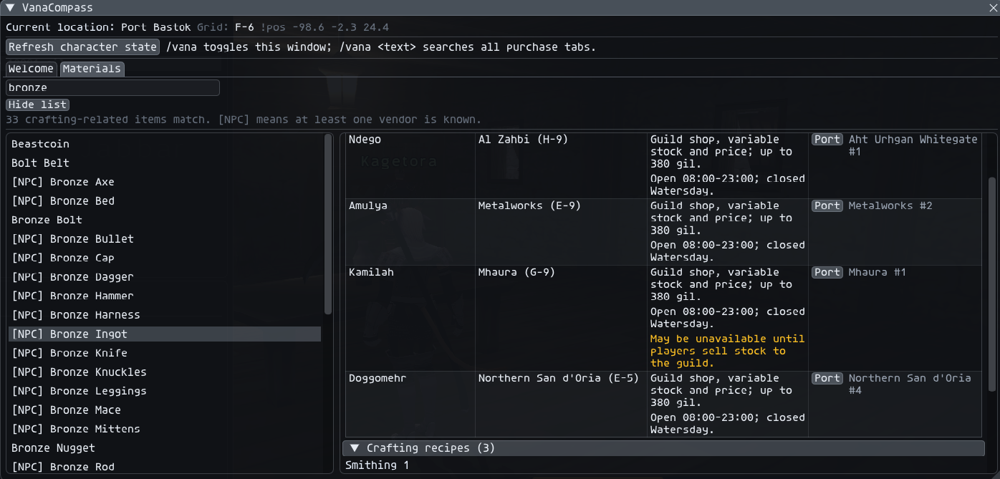
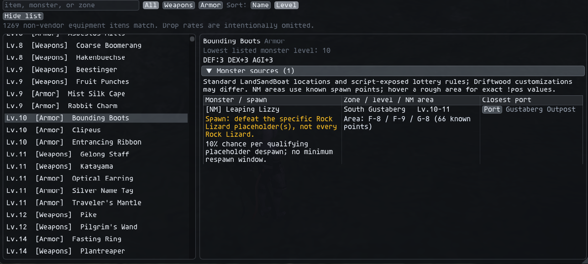
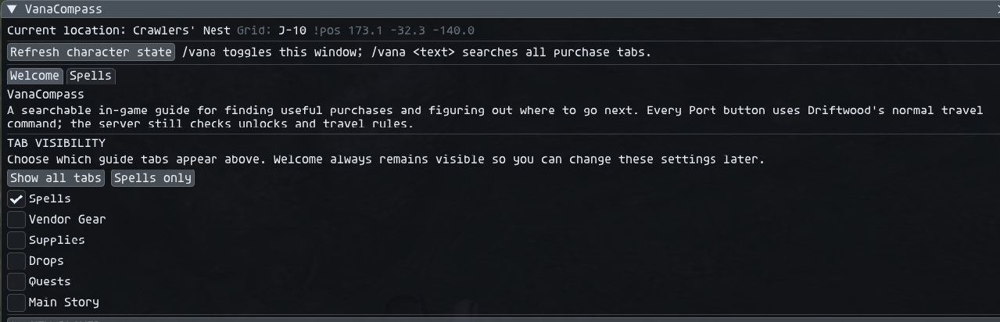

<p align="center">
  
</p>

# VanaCompass

An in-game discovery guide for **DriftwoodXI** running on **Ashita 4**.
VanaCompass helps new and returning players find spell scrolls, ordinary shop
equipment, quest starters, story missions, job unlocks, teleports, and their
current map position without leaving the game.

**Author:** Elcatrin (Spacedandy)

> Community project. Not affiliated with or endorsed by Square Enix, Ashita,
> or the DriftwoodXI team. FINAL FANTASY XI is a trademark of Square Enix.

## Highlights

- Purchasable spell scrolls filtered by job, level, learned state, and magic type
- Vendor Gear with weapons and armor filtered by equipment type, job, and level
- Standard vendor supplies with NPC, location, price, and nearest teleport
- Crafting-material lookup with ordinary and guild vendors, shop schedules,
  dynamic-stock warnings, nearest teleports, and synthesis recipes
- Monster-drop locations and synthesis recipes for listed purchases
- Searchable non-vendor weapon and armor drop browser
- Searchable NM guide with current-zone priority, spawn areas, and placeholders
- Quest and main-story guides with START NPCs, map grids, exact `!pos`, and ports
- Server-synced active, completed, and current-step quest status
- Artifact and advanced-job unlock filtering, including prerequisite chains
- Live zone, map grid, and `!pos` display with multi-map safeguards
- Collapsible results browser, responsive layout, and scrollable guide panes
- Driftwood launcher palette integration through the bundled theme adapter
- New-player Signet, Conquest Point, and EXP-ring walkthrough

## Guided tabs and nearest travel

VanaCompass is designed to answer both **what do I need?** and **how do I get
there?** Across Spells, Vendor Gear, Supplies, Materials, Drops, NMs, Quests, and Main Story, the
detail pane pairs an NPC or objective location with the closest safe Driftwood
teleport it can identify. Home Points and Survival Guides are preferred for the
requested zone, with regional Outposts used as field-zone fallbacks. Clicking
**Port** sends the normal `!port` request;
the server still enforces unlocks and travel rules. If a map is ambiguous or
has no suitable destination, VanaCompass shows **No direct port** instead of
guessing.

### Welcome

The Welcome tab is VanaCompass's settings and quick-start page. Its persistent
checkboxes choose which guide tabs appear, with **Show all tabs** and **Spells
only** shortcuts for common layouts. Welcome itself always stays visible so
hidden tabs can be restored. The collapsed **NEW PLAYER** bar explains Signet,
Conquest Points, and the EXP rings sold under **Common rewards** by home-nation
Conquest guards, and includes a **Cast Signet now** button for Driftwood's
`!signet` command. The persistent header reports your current zone, safe map
grid when known, and exact `!pos` coordinates.

### Spells

The Spells tab searches purchasable scrolls by spell name, vendor, or zone.
Use the learned-state buttons to show missing or learned spells, restrict the
list to the current job and level, or enable **Show all jobs / levels** to see
every job requirement. Results can be sorted by name or level and filtered by
magic family, including White Magic, Black Magic, Songs, Ninjutsu, and other
supported types.

Selecting a spell shows every known vendor, the vendor's exact area, price or
requirements, and a **Port** button for the closest destination to that NPC.
Tenshodo shops that require membership are clearly marked and
point to the membership quest in Lower Jeuno. Conquest restrictions, merchant
hours, quest acquisition, and special-currency unlocks remain listed on their
individual vendor rows.
When a scroll also drops from monsters, its collapsible drop section lists the
monster, zone, level range, and closest supported port. Searching for a monster
or drop zone finds matching scrolls as well.
The filter-aware **Moogle's missing-scroll bill** totals each missing spell at
its cheapest listed Gil vendor and identifies entries that require another
currency or have no fixed Gil price.


### Vendor Gear and Supplies

Vendor Gear combines weapons and armor into one searchable vendor browser with
a category selector. Weapons can be narrowed to classes such as Axe, Great
Axe, Dagger, or Great Sword, while armor can be filtered by equipment slot.
Supplies remains a separate tab for other ordinary vendor goods. Job and level
usability, item level, combat statistics, vendor, location, and price
requirements remain visible in the detail pane. Every vendor row includes its
closest available **Port** destination.
The selected item's collapsible source sections also show available monster
locations and synthesis recipes. Recipes include craft levels,
crystal, ingredients, yield, and a warning when a synthesis key item is needed.
Drop rates are intentionally omitted, and Driftwood-specific changes may differ
from the standard LandSandBoat source data.


### Materials

The optional Materials tab complements Driftwood's `/craft` recommendations.
Search for a crafting-related item such as **Bronze Ingot** to see every known
ordinary or guild-shop NPC, exact zone and grid, closest **Port**, shop hours,
guild holiday, and variable-stock warning. If the item can be synthesized,
its craft level, crystal, ingredients, and yield are listed as well.

The search waits for at least two characters and renders only visible rows, so
the full material catalog does not create a large per-frame UI workload. Guild
prices and quantities change with stock; VanaCompass reports the configured
maximum price and never guarantees that an item is currently on the shelf.



### Monster Drops

The Drops tab lists weapons and armor obtained from monsters rather than
vendors. Category and Type dropdowns filter the list by weapons, armor, weapon
class, or equipment slot. Results show the monster's level, zone, grid
location, and closest supported port. For lottery NMs, VanaCompass also
identifies the specific placeholder monster to defeat and displays the
available spawn guidance. Drop rates are intentionally omitted, and Driftwood
customizations may differ from the standard source data.



### Notorious Monsters

The optional NMs tab searches the complete generated notorious-monster
catalog by NM name, zone, or known placeholder. NMs belonging to your current
zone are always pinned above the remaining results and marked **[Here]**. The
full list can be sorted by name, level, or zone without submitting thousands
of rows to ImGui every frame.

Selecting an NM shows its level range, known grid or `!pos` area, closest
supported **Port**, and script-exposed lottery instructions when available.
The detail pane also lists equipment and spell drops already tracked elsewhere
in VanaCompass. Drop rates are intentionally omitted. Timed, forced,
battlefield, event, and other spawn types are identified as having no parsed
placeholder instructions rather than being guessed.

### Quests, Artifact quests, and Job Unlocks

The Quests tab shows level-appropriate entries by default, with toggles for
quests above the current level and already-completed quests. A tracker sync
adds active/completed status and highlights the current walkthrough step when
the server reports one. Each guide begins with a clearly labeled **START** NPC,
zone, grid coordinate, exact `!pos`, and nearest port; individual objectives
also receive Port buttons wherever safe travel data exists.

Three filters make the larger quest catalog easier to use:

- **All quests** searches the normal regional catalog.
- **Artifact quests** isolates job artifact chains and can optionally show
  artifact quests for jobs other than the one currently equipped.
- **Job Unlocks** shows every supported advanced-job unlock, not only the
  current job. Multi-quest prerequisites, such as the Paladin lead-in chain,
  are kept in required order, followed by the final job-unlock step. Reaching
  level 30 does not bypass fame, nation, or prerequisite requirements.

### Main Story

Main Story keeps national missions and **Rise of the Zilart** chains in story
order. Filters separate San d'Oria, Bastok, Windurst, and expansion progress;
the completed toggle and tracker sync help returning players see what is done
and which objective is active. Selecting a mission shows its recommended
starting NPC, precise START location, and a numbered walkthrough. START and
step locations receive nearest-port buttons when the destination is safe.


## Resizable modular interface

The window can be resized for a full guide view or compact navigation duty.
At wider sizes, the result list and detail guide sit side by side. At narrower
sizes, they stack automatically. **Hide list** collapses the browser after you
select a destination, leaving more room for the walkthrough, while independent
scrollbars keep long lists and instructions usable. The current zone, grid,
and `!pos` header remains available as the content layout changes.

The Welcome settings page can also hide any optional guide tab. This allows a
player to keep only the features they use, for example Welcome and Spells, so
the tab bar remains compact. Choices persist across addon reloads, and Welcome
always remains visible so every hidden tab can be restored. **Show all tabs**
and **Spells only** provide quick presets. Fresh installations begin with only
Spells enabled; existing saved choices are preserved when updating.




## Installation

1. Download the latest release archive.
2. Extract the folder as:

   ```text
   Ashita/addons/vanacompass/
   ```

3. In game, run:

   ```text
   /addon load vanacompass
   /vana
   ```

No separate libraries are required. Ashita 4 supplies `common`, `chat`,
`imgui`, and `settings`; all VanaCompass-specific Lua and data files are
bundled here.

## Commands

| Command | Action |
| --- | --- |
| `/vana` | Toggle the VanaCompass window |
| `/vanacompass` or `/vc` | Alternate toggle commands |
| `/vana <text>` | Open VanaCompass and search purchase tabs |
| `/vana refresh` | Refresh character, catalog, and tracker state |
| `/vana help` | Print the command summary |

## DriftwoodXI integration

VanaCompass is designed for DriftwoodXI and uses its server interfaces:

- `!port` powers destination buttons.
- `!signet` powers the Welcome-page Signet button.
- `!dwt sync` supplies active/completed quests and current objectives.
- `/tracker` opens DWTracker when its optional client addon is installed.

The window may load on another Ashita 4 server, but these integrations require
compatible server commands and data.

## New-player essentials

Keep Signet active while fighting eligible enemies in conquest regions so you
earn Conquest Points. On DriftwoodXI, `!signet` casts the buff anywhere.

Return to a Conquest guard in your home nation, choose the option to spend
Conquest Points, open **Common rewards**, and look for a Chariot Band, Empress
Band, or Emperor Band. Equip and use the ring to activate its EXP bonus.

Type `/quests` anywhere to open DriftwoodXI's Drift Board. Accept daily or
weekly contracts for your current level band, complete their objectives, and
participate in the server-wide community contract to earn **DC**, meaning
Drift Coins. The board tracks progress and shows each contract's reward.

Open the **Exchange** tab inside `/quests` to spend DC on rotating augment
offers. Choose an augment and eligible unequipped gear, review the slot and
server-quoted price, then confirm. Augmented equipment becomes account-bound
and cannot be traded, auctioned, or bazaared.

## Data accuracy

VanaCompass deliberately reports `Grid: unavailable` when a map cannot be
identified safely. Split maps and floors are not guessed. Vendor inventory and
prices may also vary with nation rank, conquest standing, fame, era, or custom
server rules.

If a vendor, teleport, quest step, or grid is wrong, please open a bug report
with the zone, entry name, expected result, and a screenshot or exact `!pos`.

## Related projects

- [Nameplate for Ashita 4.30](https://github.com/SmithReact/Nameplate) restores
  Shirk/BunnyBox Productions' GPL-3.0 nameplate rendering fix for the current
  Ashita plugin interface.

## License and attribution

The project is prepared under GPL-3.0 because its generated shop dataset is
derived from LandSandBoat. BSD attribution for FFXIMissingSpells is retained in
[`THIRD_PARTY_LICENSE.txt`](THIRD_PARTY_LICENSE.txt). Detailed provenance is in
[`DATA_SOURCES.md`](DATA_SOURCES.md) and [`NOTICE.md`](NOTICE.md).

DriftwoodXI-derived teleport identifiers, theme integration, and guide data
are included with permission. Full source and license details are recorded in
[`DATA_SOURCES.md`](DATA_SOURCES.md), [`NOTICE.md`](NOTICE.md), and
[`THIRD_PARTY_LICENSE.txt`](THIRD_PARTY_LICENSE.txt).

## Contributing

Bug reports, verified coordinate corrections, and focused pull requests are
welcome. Read [`CONTRIBUTING.md`](CONTRIBUTING.md) before changing generated
data or server-specific behavior.
