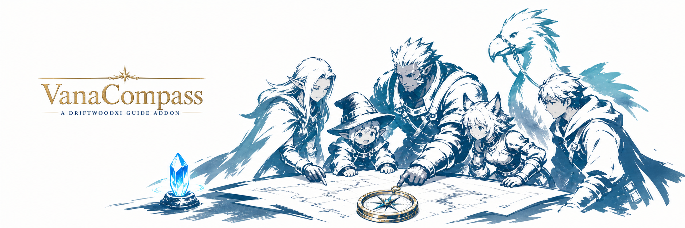
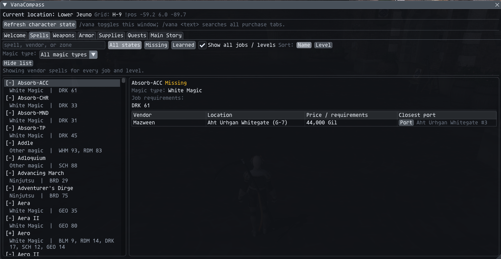
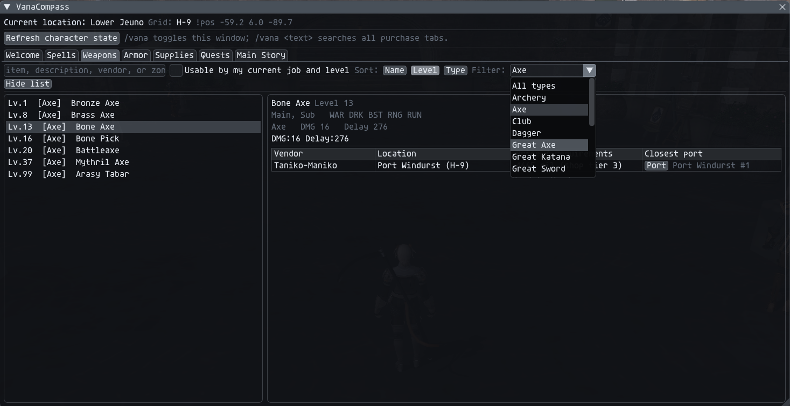
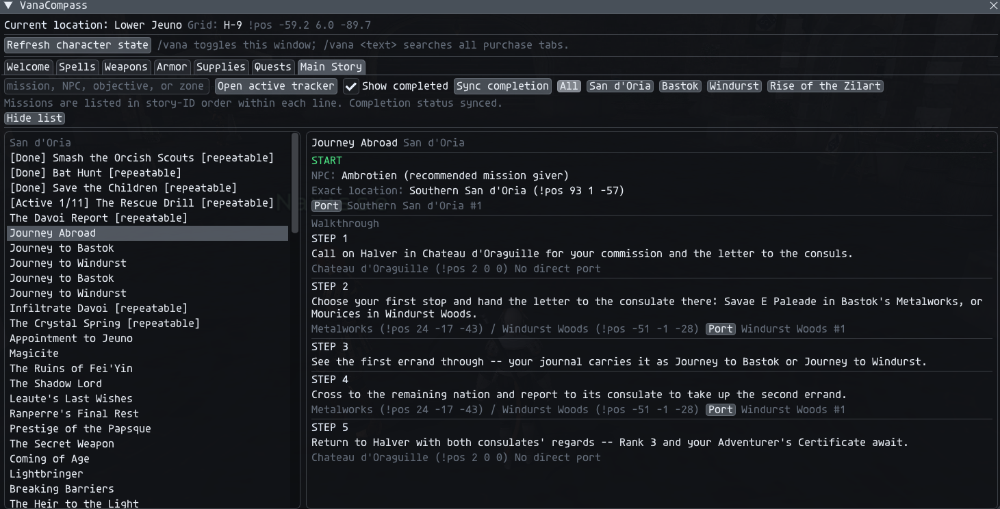
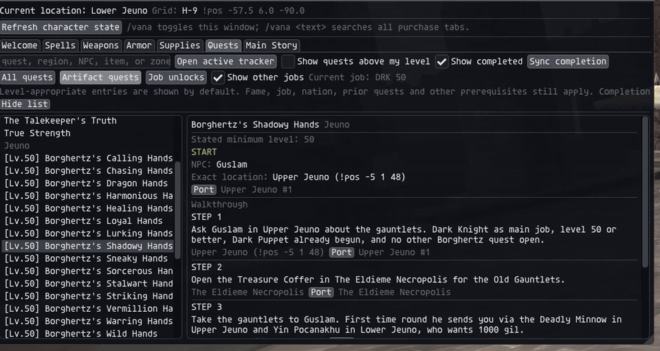

<p align="center">
  
</p>

# VanaCompass

An in-game discovery guide for **DriftwoodXI** running on **Ashita 4**.
VanaCompass helps new and returning players find spell scrolls, ordinary shop
equipment, quest starters, story missions, job unlocks, teleports, and their
current map position without leaving the game.

> Community project. Not affiliated with or endorsed by Square Enix, Ashita,
> or the DriftwoodXI team. FINAL FANTASY XI is a trademark of Square Enix.

## Highlights

- Purchasable spell scrolls filtered by job, level, learned state, and magic type
- Weapons and armor filtered by equipment type, job, and level
- Standard vendor supplies with NPC, location, price, and nearest teleport
- Monster-drop locations and synthesis recipes for listed purchases
- Searchable non-vendor weapon and armor drop browser
- Quest and main-story guides with START NPCs, map grids, exact `!pos`, and ports
- Server-synced active, completed, and current-step quest status
- Artifact and advanced-job unlock filtering, including prerequisite chains
- Live zone, map grid, and `!pos` display with multi-map safeguards
- Collapsible results browser, responsive layout, and scrollable guide panes
- Driftwood launcher palette integration through the bundled theme adapter
- New-player Signet, Conquest Point, and EXP-ring walkthrough

## Guided tabs and nearest travel

VanaCompass is designed to answer both **what do I need?** and **how do I get
there?** Across Spells, Weapons, Armor, Supplies, Quests, and Main Story, the
detail pane pairs an NPC or objective location with the closest safe Driftwood
teleport it can identify. Home Points and Survival Guides are preferred for the
requested zone, with regional Outposts used as field-zone fallbacks. Clicking
**Port** sends the normal `!port` request;
the server still enforces unlocks and travel rules. If a map is ambiguous or
has no suitable destination, VanaCompass shows **No direct port** instead of
guessing.

### Welcome

The Welcome tab is a quick-start page for new characters. It explains Signet,
Conquest Points, and the EXP rings sold under **Common rewards** by home-nation
Conquest guards. It also has a **Cast Signet now** button for Driftwood's
`!signet` command. The persistent header reports your current zone, safe map
grid when known, and exact `!pos` coordinates.

### Spells

The Spells tab searches purchasable scrolls by spell name, vendor, or zone.
Use the learned-state buttons to show missing or learned spells, restrict the
list to the current job and level, or enable **Show all jobs / levels** to see
every job requirement. Results can be sorted by name or level and filtered by
magic family, including White Magic, Black Magic, Songs, Ninjutsu, and other
supported types.

Selecting a spell shows every known vendor, the vendor's exact area, price or
requirements, and a **Port** button for the closest destination to that NPC.
When a scroll also drops from monsters, its collapsible drop section lists the
monster, zone, level range, and closest supported port. Searching for a monster
or drop zone finds matching scrolls as well.
The filter-aware **Moogle's missing-scroll bill** totals each missing spell at
its cheapest listed Gil vendor and identifies entries that require another
currency or have no fixed Gil price.



### Weapons, Armor, and Supplies

The three purchase tabs share the same searchable vendor browser. Weapons can
be narrowed to categories such as Axe, Great Axe, Dagger, or Great Sword;
Armor can be filtered by equipment slot; and Supplies collects other ordinary
vendor goods. Job/level usability, item level, combat statistics, vendor,
location, and price requirements remain visible in the detail pane. Every
vendor row includes its closest available **Port** destination.
The selected item's collapsible source sections also show available monster
locations and synthesis recipes. Recipes include craft levels,
crystal, ingredients, yield, and a warning when a synthesis key item is needed.
Drop rates are intentionally omitted, and Driftwood-specific changes may differ
from the standard LandSandBoat source data.



### Monster Drops

The Drops tab searches non-vendor equipment sources in both directions:
enter an item such as **Bounding Boots**, or a monster such as **Leaping
Lizzy**, to reach the same source details. The catalog contains only weapons
and armor with a monster source that are absent from VanaCompass's standard
vendor inventory; spells, materials, and quest-objective items are excluded.
Filters isolate weapons or armor. Selecting a result shows every retained
monster and zone, its standard level range, and the closest supported port.
Both normal monsters and notorious monsters appear when they provide matching
equipment, with notorious-monster sources tagged **NM**. NM rows show a map
grid and exact `!pos` for fixed spawns; lottery or multi-spawn NMs show a rough
multi-grid area with exact known points available on hover. When the standard
server script exposes a lottery relationship, the row also identifies the
specific placeholder family, chance per qualifying despawn, and minimum
respawn window. It does not instruct players to clear an entire monster family
when only designated placeholder slots count. Ambiguous dungeon pages remain
explicitly unavailable rather than guessing. Every result displays the lowest
known monster level that can drop it, and the full catalog can be sorted by
name or that level across both categories.
Large lists are paged and the item browser is virtualized so the complete
catalog does not create per-frame UI load. Drop rates are intentionally omitted.

This baseline comes from LandSandBoat. Driftwood can customize NM rewards,
locations, or progression, so server behavior remains authoritative.

### Quests, Artifact quests, and Job Unlocks

The Quests tab shows level-appropriate entries by default, with toggles for
quests above the current level and already-completed quests. A tracker sync
adds active/completed status and highlights the current walkthrough step when
the server reports one. Each guide begins with a clearly labeled **START** NPC,
zone, grid coordinate, exact `!pos`, and nearest port; individual objectives
also receive Port buttons wherever safe travel data exists.

Three filters make the larger quest catalog easier to use:

- **All quests** searches the normal regional catalog.
- **Artifact quests** isolates job artifact chains and can optionally show
  artifact quests for jobs other than the one currently equipped.
- **Job Unlocks** shows every supported advanced-job unlock, not only the
  current job. Multi-quest prerequisites—such as the Paladin lead-in chain—are
  kept in required order, followed by the final job-unlock step. Reaching
  level 30 does not bypass fame, nation, or prerequisite requirements.

### Main Story

Main Story keeps national missions and **Rise of the Zilart** chains in story
order. Filters separate San d'Oria, Bastok, Windurst, and expansion progress;
the completed toggle and tracker sync help returning players see what is done
and which objective is active. Selecting a mission shows its recommended
starting NPC, precise START location, and a numbered walkthrough. START and
step locations receive nearest-port buttons when the destination is safe.



## Resizable modular interface

The window can be resized for a full guide view or compact navigation duty.
At wider sizes, the result list and detail guide sit side by side. At narrower
sizes, they stack automatically. **Hide list** collapses the browser after you
select a destination, leaving more room for the walkthrough, while independent
scrollbars keep long lists and instructions usable. The current zone, grid,
and `!pos` header remains available as the content layout changes.



## Installation

1. Download the latest release archive.
2. Extract the folder as:

   ```text
   Ashita/addons/vanacompass/
   ```

3. In game, run:

   ```text
   /addon load vanacompass
   /vana
   ```

No separate libraries are required. Ashita 4 supplies `common`, `chat`, and
`imgui`; all VanaCompass-specific Lua and data files are bundled here.

## Commands

| Command | Action |
| --- | --- |
| `/vana` | Toggle the VanaCompass window |
| `/vanacompass` or `/vc` | Alternate toggle commands |
| `/vana <text>` | Open VanaCompass and search purchase tabs |
| `/vana refresh` | Refresh character, catalog, and tracker state |
| `/vana help` | Print the command summary |

## DriftwoodXI integration

VanaCompass is designed for DriftwoodXI and uses its server interfaces:

- `!port` powers destination buttons.
- `!signet` powers the Welcome-page Signet button.
- `!dwt sync` supplies active/completed quests and current objectives.
- `/tracker` opens DWTracker when its optional client addon is installed.

The window may load on another Ashita 4 server, but these integrations require
compatible server commands and data.

## New-player essentials

Keep Signet active while fighting eligible enemies in conquest regions so you
earn Conquest Points. On DriftwoodXI, `!signet` casts the buff anywhere.

Return to a Conquest guard in your home nation, choose the option to spend
Conquest Points, open **Common rewards**, and look for a Chariot Band, Empress
Band, or Emperor Band. Equip and use the ring to activate its EXP bonus.

## Data accuracy

VanaCompass deliberately reports `Grid: unavailable` when a map cannot be
identified safely. Split maps and floors are not guessed. Vendor inventory and
prices may also vary with nation rank, conquest standing, fame, era, or custom
server rules.

If a vendor, teleport, quest step, or grid is wrong, please open a bug report
with the zone, entry name, expected result, and a screenshot or exact `!pos`.

## Related projects

- [Nameplate for Ashita 4.30](https://github.com/SmithReact/Nameplate) restores
  Shirk/BunnyBox Productions' GPL-3.0 nameplate rendering fix for the current
  Ashita plugin interface.

## License and attribution

The project is prepared under GPL-3.0 because its generated shop dataset is
derived from LandSandBoat. BSD attribution for FFXIMissingSpells is retained in
[`THIRD_PARTY_LICENSE.txt`](THIRD_PARTY_LICENSE.txt). Detailed provenance is in
[`DATA_SOURCES.md`](DATA_SOURCES.md) and [`NOTICE.md`](NOTICE.md).

DriftwoodXI-derived teleport identifiers, theme integration, and guide data
are included with permission. Full source and license details are recorded in
[`DATA_SOURCES.md`](DATA_SOURCES.md), [`NOTICE.md`](NOTICE.md), and
[`THIRD_PARTY_LICENSE.txt`](THIRD_PARTY_LICENSE.txt).

## Contributing

Bug reports, verified coordinate corrections, and focused pull requests are
welcome. Read [`CONTRIBUTING.md`](CONTRIBUTING.md) before changing generated
data or server-specific behavior.
